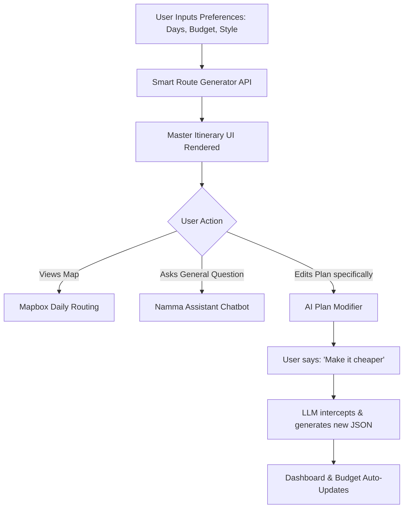

# NammaWay - AI-Powered Travel & Relocation Assistant

## 1. Brief about your idea/prototype
**NammaWay** is an AI-driven, highly personalized travel and relocation dashboard designed to simplify planning for users visiting or moving to a new city (with a current localized focus on Coimbatore). It generates end-to-end, multi-day itineraries, manages granular budget breakdowns, provides dynamic route mapping, and crucially features a **real-time AI Plan Modifier** that allows users to seamlessly customize their trip via natural language chat.

## 2. Opportunities
*   **Surge in Domestic & Experiential Travel:** People are moving away from generic package tours toward personalized, self-guided trips.
*   **Relocation Challenges:** Students and working professionals face overwhelming decisions (housing, commute, food) when moving to Tier-2 booming cities like Coimbatore.
*   **Local Business Integration:** A massive opportunity exists to partner with local hyper-specific vendors (e.g., local messes, private cabs) rather than corporate chains.

## 3. How different is it from any of the other existing ideas?
Unlike static booking portals (MakeMyTrip, Booking.com) which only sell tickets, or generic AI tools (ChatGPT) which output plain text, NammaWay bridges the gap by **tying AI directly to a living UI interface**. 
When a user tells the AI, *"Change my Day 1 dinner to Subu Mess"*, the platform doesn't just reply with text—it intercepts the intent, rewrites the underlying JSON data, and instantly updates the live itinerary, the visual route map, and the daily budget calculator without requiring a full page reload or complete plan regeneration.

## 4. How will it be able to solve the problem?
Planning a trip or relocation is severely fragmented—users bounce between Maps, Excel sheets, Chatbots, and booking sites. NammaWay solves this by centralizing the flow. It acts as an interactive "command center", intelligently computing travel distances across locations, predicting meal and entry costs, and ensuring users have a financially safe and logistically possible schedule.

## 5. USP of the proposed solution
*   **Context-Aware AI Plan Modifier:** A slide-out AI panel that understands exactly what day and activity you are looking at and intuitively modifies only the requested blocks using LLM function-calling capabilities.
*   **Dynamic Budget Recalibration:** Instantly updates overall cost, cumulative day limits, and provides "savings warnings" if a user's modification pushes them over budget.
*   **Live Route Tracking:** Integrating Mapbox to visualize the exact generated route for each individual day.

## 6. List of features offered by the solution
*   **Smart Plan Generator:** Collects user variables (budget, days, veg/non-veg, transport preference) to build a robust baseline itinerary.
*   **Interactive Master Itinerary Dashboard:** Visual, day-by-day timeline of activities with accurate timestamps and cost markers.
*   **Floating "Namma Assistant":** A universal assistant available site-wide to answer general city-related queries.
*   **"Modify Plan" AI Chat:** Natural language editor powered by Groq (Llama-3.3-70b) to dynamically inject replacements into the JSON state.
*   **Event Simulators:** Features like "Simulate Delay" to showcase how the app dynamically handles real-world disruptions (e.g., pushing timelines back by 30 mins).
*   **Granular Budget Breakdown Component:** Clear visualization of Stay vs. Food vs. Travel vs. Activities.

## 7. Process flow or Use-case diagram

## 8. Wireframes/Mock diagrams of the proposed solution
*Note: As this is a functional prototype, the UI acts as its own high-fidelity wireframe.*
*   **Left Panel:** Detailed Trip Summary and dynamically updating Budget Breakdown pie/progress charts.
*   **Center Stage:** Scrollable day-by-day timeline cards with associated status tags, times, and emojis.
*   **Right Panel (Collapsible):** AI Chat Modifier widget for seamless conversation and prompt suggestions.
*   **Top Header:** Quick controls, delay simulators, and day-filter tabs.

## 9. Architecture diagram of the proposed solution

## 10. Technologies to be used in the solution
*   **Frontend Framework:** React.js (TypeScript) built with Vite for optimal performance.
*   **Styling:** TailwindCSS, Vanilla CSS, and Framer Motion for premium, modern micro-animations.
*   **Icons & Components:** Lucide-React.
*   **Maps & Routing:** Mapbox GL API.
*   **AI Integrations:** Groq Inference Engine utilizing Meta's `llama-3.3-70b-versatile` and `llama-3.1-8b-instant` models.

## 11. Usage of AMD Products/Solutions
To elevate this solution to an enterprise, privacy-first, or massive-scale product, **AMD hardware and software ecosystems** would be utilized directly in the AI backend:
*   **AMD Instinct™ MI300X Accelerators:** Instead of relying on external Groq endpoints, the complex JSON-modifying Large Language Models (like Llama-3-70B) would be hosted on private cloud infrastructure utilizing AMD Instinct GPUs. This ensures data sovereignty and significantly higher memory bandwidth for concurrent user inferences, reducing API costs at scale.
*   **AMD ROCm™ Open Software Platform:** The backend model serving architecture would utilize ROCm for optimized inference processing, ensuring the split-second low latency required for real-time UI updates during chatbot interactions.
*   **AMD Ryzen™ AI (Edge Computing):** For frequent travelers lacking internet connections, the application could eventually deploy smaller, quantized versions of the itinerary assistant directly onto local AI PCs powered by Ryzen AI (NPU). This enables complete offline natural language processing for sensitive on-device trip modifications.

## 12. Estimated implementation cost (optional)
*   **Prototype Phase:** $0 (Utilizing Free Tier Mapbox, Groq, and Vercel hosting).
*   **Early Production (10k Users/month):**
    *   Mapbox APIs & Routing: ~$150/month
    *   Managed Cloud Hosting (Vercel/AWS): ~$100/month
    *   AI Inference Compute / APIs: ~$250/month
    *   **Total Estimate:** ~$500/month for scalable operational costs.
