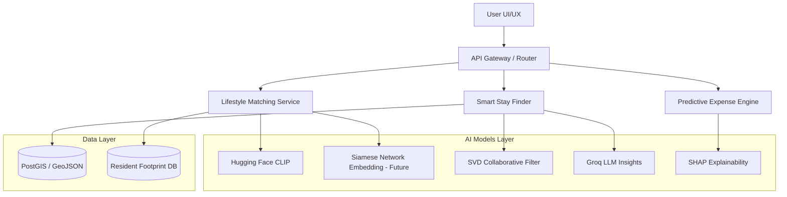
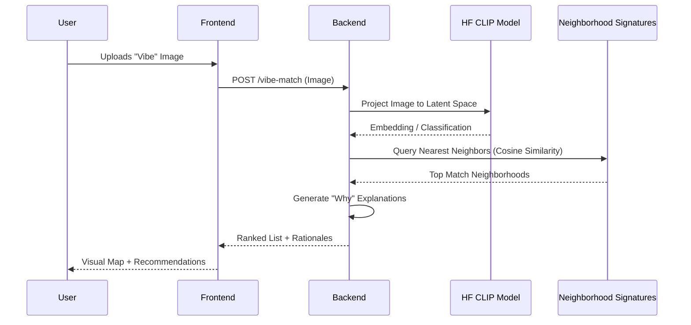
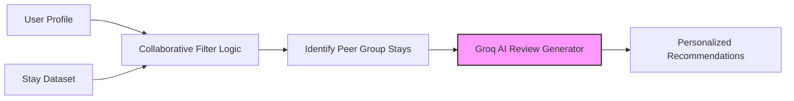
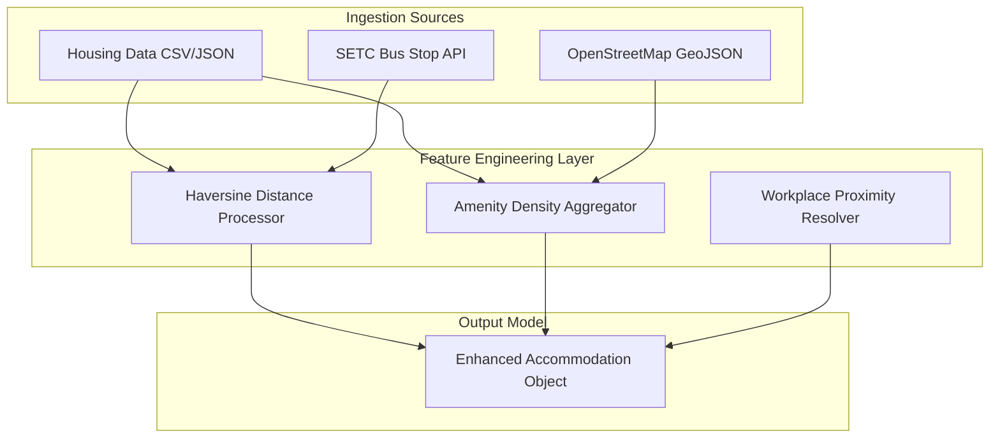

# NammaWay AI: Technical Design Document 🏗️

This document details the architectural decisions, AI/ML pipelines, and data flow of the NammaWay AI platform, designed for the AMD Slingshot Hackathon.

---

## 🏛️ 1. High-Level System Architecture

NammaWay AI uses a modular architecture with a React-based frontend and a multi-service backend that integrates various AI models for personalized discovery.

---

## 🧠 2. AI/ML Component Detail

### A. Vibe Matcher Pipeline (Photo-to-Lifestyle)
The vibe matcher uses zero-shot classification to map visual "vibes" to neighborhood social signatures.

### B. Smart Stay Collaborative Filtering
This peer-based recommendation system combines matrix factorization concepts with LLM-powered content generation.

---

## 🛠️ 3. Data Engineering & Feature Fusion

The Smart Stay Finder relies on a "Feature Fusion" layer that merges static housing data with dynamic urban infrastructure data.

---

## 🎨 4. Design Philosophy: Transparent Recommenders

- **"Why this match"**: Every recommendation includes a rationale (e.g., "92% Match: Near your workspace + High coffee shop density").
- **Budget Respect**: Models are constrained by user-defined budget sliders before any personal ranking is applied.
- **Explainability (SHAP)**: Cost predictions are accompanied by SHAP visualizations to show which factors (AC, Square Footage, Proximity) impacted the final estimate most.

---

## 🚀 5. Scalability & Roadmap

### Scalability
- **pgvector Integration**: Moving from in-memory cosine similarity to database-level vector search for sub-millisecond similarity queries across thousands of areas.
- **Edge Computing**: Using ONNX or TensorFlow.js to move inference tasks (like classification) to the client-side.

### Future Roadmap
1. **Deeper Embeddings**: Moving from heuristic triplets to a Triplet Loss trained Siamese Network for the Vibe Matcher.
2. **Context-Aware LLM Agents**: Integrating RAG (Retrieval-Augmented Generation) so the booking assistant can "read" latest local events/news and factor them into travel planning.
3. **Accessibility Integration**: Explicitly modeling mobility constraints in the feature engineering layer for more inclusive urban discovery.
